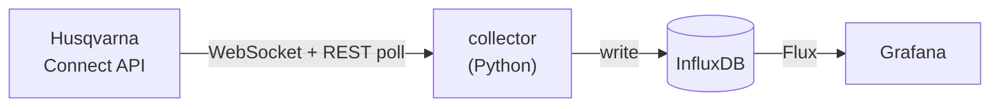

# Automower Dashboard

Self-hosted **historic + real-time Grafana dashboard** for a Husqvarna Automower,
on the official [Automower Connect API](https://developer.husqvarnagroup.cloud/apis).
A small Python collector feeds InfluxDB; Grafana shows it. Runs anywhere
`docker compose` runs — a Raspberry Pi, a NAS, or a homelab server.

## Quickstart

**One file. No clone, no build.** Grab the compose file into an empty folder and
start it:

```bash
mkdir automower-dashboard && cd automower-dashboard
curl -O https://raw.githubusercontent.com/robertobasile84/husqvarna-automower-dashboard/main/compose.yaml
docker compose up -d
```

Open **http://localhost:3005**. The dashboard is already there, filling with
**demo data** — no login, nothing to configure. **That's it.**

- 🌱 **Put your real mower on it** → [Run it for real](#run-it-for-real) (add a `.env`)
- 🛠️ **Change it or contribute** → clone to contribute, fork + build to modify — see [Working on the dashboard](#working-on-the-dashboard)

## What you get

- **Near-real-time** battery %, activity, state, mode, cutting height, online
  status, and last error (as readable text, not just a code) — pushed over the
  WebSocket. Husqvarna batches these to save the mower's battery, so they arrive
  roughly every 15 minutes, not continuously.
- **GPS position** map (the Connect API returns the last 50 positions for
  GPS-assisted models; the collector stores each update to build a track).
- **Historic** statistics: total cutting / running / charging / searching time,
  blade usage, charging cycles, collisions, drive distance — with trend charts.
- A provisioned Grafana dashboard (as code) and InfluxDB datasource — nothing to
  click to set up; it appears on first boot.



## Requirements

Just **Docker + Docker Compose v2** — nothing else. Same on Windows (Docker
Desktop), macOS (Docker Desktop / OrbStack), and Linux (Docker Engine + the
`docker compose` plugin). All images are multi-arch (amd64 / arm64), so a
Raspberry Pi, an x86 PC, and an Apple-silicon Mac run the identical stack.

## Run it for real

1. A Husqvarna Automower with a **Connect** module, already paired to your
   account in the Automower Connect mobile app.
2. An **Application** on the [Husqvarna Developer Portal](https://developer.husqvarnagroup.cloud/apis)
   with **both** the *Authentication API* and the *Automower Connect API*
   connected. From it you need the **Application key** (`client_id`) and the
   **Application secret** (`client_secret`, under *Show more*).

   > The collector uses the OAuth2 **client-credentials** grant, tied to your own
   > account — so no interactive login/redirect is needed. Any application in
   > your developer account works; you can reuse an existing one.

In the **same folder** as your `compose.yaml`, create a `.env` — this is the
minimal real-data setup:

```bash
# .env
HUSQVARNA_CLIENT_ID=your-application-key
HUSQVARNA_CLIENT_SECRET=your-application-secret

# Secure the stack for anything networked (random token: openssl rand -hex 32).
INFLUXDB_TOKEN=replace-with-a-long-random-string
GRAFANA_PASSWORD=replace-with-a-password
GRAFANA_ANONYMOUS=false      # require a Grafana login (auto-off for a real mower; set explicitly to override)

# Center the Position map on your lawn (any map site → right-click → coordinates).
MAP_LAT=42.7135
MAP_LON=-83.1286
MAP_ZOOM=18
```

Then (re)launch:

```bash
docker compose up -d
```

With credentials present the collector connects to the real API instead of the
simulator. Open Grafana at **http://localhost:3005**; InfluxDB's own UI is at
**http://localhost:8086** for poking at raw data. Every available knob is listed
in [`.env.example`](.env.example) and under [Configuration](#configuration).

Data accumulates from the moment the collector starts; the statistics counters
are cumulative lifetime totals reported by the mower, so the trend panels get
more useful over days and weeks.

> **Windows note:** the commands above are shell-agnostic. In PowerShell, use
> `Copy-Item .env.example .env` instead of `cp`.

## Configuration

Everything is environment variables (see [`.env.example`](.env.example)). The
ones you'll actually touch:

| Variable | Default | Notes |
|---|---|---|
| `HUSQVARNA_CLIENT_ID` / `HUSQVARNA_CLIENT_SECRET` | — | Application key / secret. Leave empty for demo mode |
| `DEMO_MODE` | — | `true` forces synthetic data even if credentials are set |
| `INFLUXDB_TOKEN` | — | Shared by InfluxDB, collector, Grafana (required) |
| `GRAFANA_PORT` | `3005` | Grafana host port |
| `INFLUXDB_PORT` | `8086` | InfluxDB host port |
| `INFLUXDB_RETENTION` | `0s` | `0s` = keep forever; or e.g. `730d` |
| `REST_POLL_INTERVAL` | `3600` | Seconds between REST polls (statistics refresh) |
| `WRITE_POSITIONS` | `true` | Set `false` to skip storing GPS positions |
| `LOG_LEVEL` | `INFO` | `DEBUG` to see every event and write |
| `MAP_LAT` / `MAP_LON` / `MAP_ZOOM` | Zürich demo location | Center of the Position map — see below |
| `GRAFANA_ANONYMOUS` | auto | Auto-decided from demo mode: anonymous read-only view **on** for the demo, **off** (login required) for a real mower so a personal dashboard isn't exposed. Set `true`/`false` to override |

### Centering the map on your mower

The **Position** panel uses a fixed satellite view. Out of the box it centers on
the demo location (Zürich). To point it at your own lawn, set the coordinates in
`.env` and restart Grafana:

```bash
# in .env — find the values on any map site (right-click → coordinates)
MAP_LAT=45.4642
MAP_LON=9.1900
MAP_ZOOM=18     # ~17-18 is a garden-sized close-up

docker compose up -d grafana
```

Your coordinates live only in your `.env` (which is gitignored), so they never
end up in the repo. Leave them unset and the map just stays on the demo location.

## How it works

The Python project is managed with [uv](https://docs.astral.sh/uv/): dependencies
are declared in `collector/pyproject.toml` and pinned in `collector/uv.lock`, and
the Docker image builds from that lockfile for reproducible, multi-arch builds.

The API surface (endpoints, data model, WebSocket events, and the control-action
blueprint) is distilled in [`docs/api-reference.md`](docs/api-reference.md),
cross-checked against Husqvarna's official OpenAPI spec.

- **`collector/husqvarna.py`** — a ~250-line async client: OAuth2 token handling
  (auto-refresh), `GET /mowers` for the full snapshot, and a resilient WebSocket
  listener with app-level keep-alives, token-aware reconnects before the ~2h
  server cap, and exponential backoff.
- **`collector/collector.py`** — keeps an in-memory copy of each mower's
  attributes (seeded from REST, updated by WebSocket `*-event-v2` deltas) and
  writes an InfluxDB point on every change. Statistics come from the REST poll;
  status/battery/position updates come from the WebSocket.
- WebSocket updates cost no REST quota, but the mower throttles them to ~every
  15 minutes (battery saving). The REST poll (hourly by default) refreshes
  statistics and acts as a backstop — lower `REST_POLL_INTERVAL` toward `900`
  if you want guaranteed sub-15-minute freshness without relying on the socket.

### Measurements

| Measurement | Key fields |
|---|---|
| `automower_status` | `battery_percent`, `activity`, `state`, `mode`, `error_code`, `error_text`, `is_online`, `is_mowing`, `is_charging`, `cutting_height`, `next_start_epoch` |
| `automower_statistics` | `total_cutting_time`, `total_running_time`, `total_charging_time`, `cutting_blade_usage_time`, `number_of_charging_cycles`, `number_of_collisions`, `total_drive_distance`, … (seconds / counts / meters) |
| `automower_position` | `latitude`, `longitude` |

All are tagged with `mower`, `mower_id`, and `model`.

## Operations

```bash
docker compose logs -f collector     # watch it connect + write
docker compose pull && docker compose up -d   # update to the latest image
docker compose down                  # stop (data persists in named volumes)
```

The stack keeps state in named volumes (`influxdb-data`, `grafana-data`). Back up
`influxdb-data` to preserve history.

## Working on the collector (uv)

You don't need a local Python at all — Docker handles everything. To run the
stack with the collector **built from your working tree** (instead of pulling the
published image), layer on the dev overlay:

```bash
docker compose -f compose.yaml -f compose.dev.yaml up -d --build
```

To iterate on the collector outside Docker:

```bash
cd collector
uv sync                 # create .venv from the lockfile
uv run python collector.py    # needs INFLUXDB_* env + a reachable InfluxDB
uvx ruff@0.8 check .          # lint before opening a PR
```

Change dependencies in `pyproject.toml`, then `uv lock` to refresh `uv.lock`
(commit both). The Docker image installs strictly from `uv.lock`, so a build is
reproducible and matches your local env.

See [CONTRIBUTING.md](CONTRIBUTING.md) for the full workflow — `main` is
protected, so changes land through pull requests.

## Working on the dashboard

Grafana is also a published image (`automower-grafana`) — the stock Grafana with
this project's dashboard, InfluxDB datasource, and provisioning baked in from the
[`grafana/`](grafana/) folder, plus a small entrypoint that stamps the map center
(`MAP_LAT`/`MAP_LON`/`MAP_ZOOM`) into the dashboard at startup. That's why running
the stack needs no `grafana/` folder and dashboard updates ship as an image tag.

To change the dashboard, edit [`grafana/dashboards/automower.json`](grafana/dashboards/automower.json)
(easiest: tweak it in the Grafana UI, then **Dashboard settings → JSON Model** →
copy it back over that file), then rebuild just Grafana from source:

```bash
docker compose -f compose.yaml -f compose.dev.yaml up -d --build grafana
```

Merging to `main` republishes both images; consumers get the new dashboard with a
plain `docker compose pull`.

## Talk to your dashboard with an AI assistant (MCP)

An optional overlay runs [Grafana's official MCP server](https://github.com/grafana/mcp-grafana)
next to the stack, so an MCP client (Claude, etc.) can search your dashboard and
query the mower data directly.

1. **Create a Grafana service-account token** — in Grafana, *Administration →
   Service accounts → Add* (role **Viewer**) → *Add service account token* → copy it.
2. **Put it in `.env`**: `GRAFANA_SERVICE_ACCOUNT_TOKEN=glsa_…`
3. **Start with the overlay:**
   ```bash
   docker compose -f compose.yaml -f compose.mcp.yaml up -d
   ```
   The MCP server reaches Grafana in-network (`http://grafana:3000`) — no tunnel
   needed — and listens on `http://<host>:8000/mcp` (streamable HTTP).
4. **Point your client at it.** For Claude Code:
   ```bash
   claude mcp add --transport http automower http://localhost:8000/mcp
   ```

### How it's exposed (your call)

The MCP endpoint has **no auth of its own** — the service-account token only scopes
what it can read from Grafana (a Viewer token keeps it read-only). So *you* decide
what network it listens on, via `MCP_BIND` in `.env`:

| `MCP_BIND` | Reachable from | Connect with |
|---|---|---|
| `127.0.0.1` (default) | localhost only | an SSH tunnel: `ssh -L 8000:localhost:8000 <host>` → `http://localhost:8000/mcp` |
| `<tailnet-ip>` (`tailscale ip -4`) | your tailnet only | `http://<host>:8000/mcp` over Tailscale |
| `0.0.0.0` | all interfaces incl. LAN | `http://<host>:8000/mcp` — only on a network you trust |

Then register it (Claude Code):
```bash
claude mcp add --transport http automower http://<host>:8000/mcp
```

## Deploying to a homelab

This is a standalone stack, but it drops straight into a per-service Compose
homelab (like `srv-basement`). Because **both** images are pulled from GHCR
(collector *and* Grafana, with the dashboard baked in), you only need
`compose.yaml` and your `.env` — no `grafana/` folder, no source
checkout or build. Add a catalog row, and — if you want a cert'd name for the
Grafana UI — front it with your usual Tailscale Serve sidecar. Only the
collector's outbound HTTPS/WSS to Husqvarna is required; nothing needs to be
exposed publicly.
